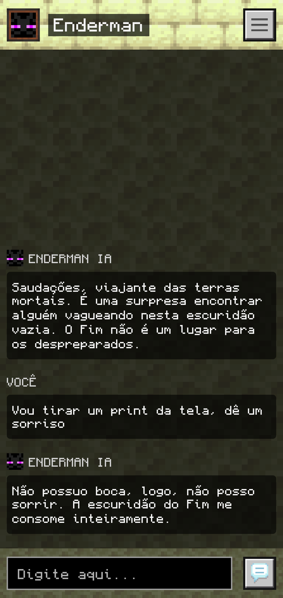
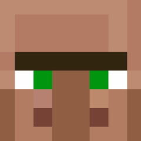

# <div style="display: flex; align-items: center; max-height: max-content"> Minechat</div>

O projeto Minechat é um aplicativo móvel desenvolvido com React Native e Expo, projetado para oferecer uma experiência de chat interativa com vários personagens do jogo Minecraft, através do uso de inteligência artificial.

### Versão 1.0 para Android: <a href="">download do aplicativo</a>

|              Chat                        |               Configurações                |
| ---------------------------------------- | ----------------------------------------   |
|           |  |

## Personagens disponíveis

- <div style="display: flex; align-items: center; max-height: max-content"> <b>Mooshroom</b></div>
- <div style="display: flex; align-items: center; max-height: max-content"> <b>Pig</b></div>
- <div style="display: flex; align-items: center; max-height: max-content"> <b>Villager</b></div>
- <div style="display: flex; align-items: center; max-height: max-content"> <b>Creeper</b></div>
- <div style="display: flex; align-items: center; max-height: max-content"> <b>Skeleton</b></div>
- <div style="display: flex; align-items: center; max-height: max-content"> <b>Zombie</b></div>
- <div style="display: flex; align-items: center; max-height: max-content"> <b>Enderman</b></div>
- <div style="display: flex; align-items: center; max-height: max-content"> <b>Ghast</b></div>

## Temas baseados nos personagens

- <div style="display: flex; align-items: center; max-height: max-content"> <b>Cave</b></div>
- <div style="display: flex; align-items: center; max-height: max-content"> <b>Village</b></div>
- <div style="display: flex; align-items: center; max-height: max-content"> <b>Mushroom Fields</b></div>
- <div style="display: flex; align-items: center; max-height: max-content"> <b>End</b></div>
- <div style="display: flex; align-items: center; max-height: max-content"> <b>Nether</b></div>

## Para desenvolvedores

### Instalando módulos

```
npm install
```

### Executando o aplicativo

```
npm run start
```
