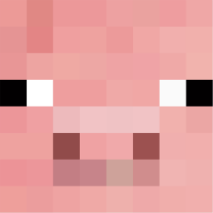

# <div style="display: flex; align-items: center; max-height: max-content"> Minechat</div>

O projeto Minechat é um aplicativo móvel desenvolvido com React Native e Expo, projetado para oferecer uma experiência de chat interativa com vários personagens do jogo Minecraft, através do uso de inteligência artificial.

<br>
<h2 align = "center">Screenshots dentro do app</h2>

<p align="center" style="display: flex;">
  
  
</p>

<br>

## Personagens disponíveis

- <div style="display: flex; align-items: center; max-height: max-content"> <b>Mooshroom</b></div>
- <div style="display: flex; align-items: center; max-height: max-content"> <b>Pig</b></div>
- <div style="display: flex; align-items: center; max-height: max-content"> <b>Villager</b></div>
- <div style="display: flex; align-items: center; max-height: max-content"> <b>Creeper</b></div>
- <div style="display: flex; align-items: center; max-height: max-content"> <b>Skeleton</b></div>
- <div style="display: flex; align-items: center; max-height: max-content"> <b>Zombie</b></div>
- <div style="display: flex; align-items: center; max-height: max-content"> <b>Enderman</b></div>
- <div style="display: flex; align-items: center; max-height: max-content"> <b>Ghast</b></div>

## Temas baseados nos personagens

- <div style="display: flex; align-items: center; max-height: max-content"> <b>Cave</b></div>
- <div style="display: flex; align-items: center; max-height: max-content"> <b>Village</b></div>
- <div style="display: flex; align-items: center; max-height: max-content"> <b>Mushroom Fields</b></div>
- <div style="display: flex; align-items: center; max-height: max-content"> <b>End</b></div>
- <div style="display: flex; align-items: center; max-height: max-content"> <b>Nether</b></div>

<br>

## <h2>Para desenvolvedores</h2>

### Configurando a chave da API

Crie um arquivo chamado `API_KEY.js` na raíz do projeto com sua chave da <a href="https://ai.google.dev/tutorials/web_quickstart?hl=pt-br#set-up-project">API Gemini</a>:

```js
export default API_KEY = '<SUA_CHAVE>';
```

### Instalando módulos

```
npm install
```

### Executando o aplicativo

```
npm run start
```

## Tecnologias e bibliotecas utilizadas:

- Figma
- Android Studio Virtual Device e Logcat
- React Native e Expo
- React Navigation
- Async Storage
- Google AI - API Gemini
